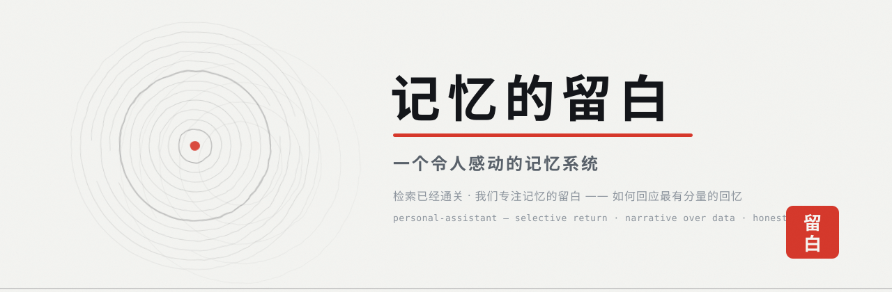

<p align="center">
  
</p>

<h1 align="center">记忆的留白</h1>

<p align="center">
  <b>personal-assistant · 一个令人感动的记忆系统</b><br />
  <sub><i>检索的时代已经通关。我们做的是下一件事：当记忆有了分量，系统该如何回应。</i></sub>
</p>

<p align="center">
  <a href="#系统是什么样子">系统</a> ·
  <a href="#快速开始">快速开始</a> ·
  <a href="web/design-system/DESIGN.md">设计语言「年轮 · 墨迹」</a> ·
  MIT License
</p>

---

## 一件已经解决的事，和一件还没人做的事

过去十年，几乎所有记忆系统都在回答同一个问题：**怎么找回来。**
向量库、知识图谱、混合召回、RAG——这条赛道已经通关。
本项目的检索层（混合召回 + 实体图谱 + 声纹归档）也早已是成熟能力。它是地基，但不再是故事。

真正还没有人认真做的，是下一个问题：

> **当一个人说出他一生中最重的那段回忆时，**
> **一个「什么都记得」的系统，应该说什么、不说什么、什么时候沉默。**

这是本项目认为的革命性所在：**记忆系统的下半场，不是检索，是留白。**

## 留白：记忆的呼吸

中国画里的空白从来不是没画完，而是画面呼吸的地方。
记忆系统也一样——**它的质量不由「记住了多少」决定，而由「如何节制地使用记忆」决定。**

一个什么都往外倒的记忆系统是一种冒犯：在你最脆弱的时刻，它精准引用你说过的每句话，像出示证据。

这个系统选择做相反的事：

- **选择性归还** —— 记忆不主动涌来；只在真正该出现的时刻，被轻轻地放回你面前。
- **叙事优先于数据** —— 数量从来不是问题，问题是对时刻的叙事与理解。一条被理解的时刻，胜过一万条被索引的记录。
- **知道什么不说** —— 系统保留沉默的权利。不是所有被记住的事都适合被提起；留白是尊重，不是遗漏。
- **不表演共情** —— 没有感叹号式的热络，没有伪装成人的煽情。在场，但不打扰。

## 回应最有分量的时刻

每个人心里都有几段不敢轻易碰的回忆：逝去的人、回不去的地方、没说出口的话。
当它们出现在对话里，这个系统的行为准则只有四条：

1. **先在场，后回应。** 不检索、不推荐、不「你可能还想看」。那一刻系统唯一的任务，是接住这句话。
2. **把记忆当遗物，不当数据。** 重要的时刻以朱砂落印——标记为不可改写的证据，永不进入任何「优化」与「清理」。
3. **归还，而不是复述。** 多年后的某个恰当瞬间，把那天的细节原样奉还——你以为忘了它还在，而它一直替你留着。
4. **诚实地沉默。** 没有合适的话时，就不说。空白本身就是回应的一种。

## AI 最终带给人类的价值

这个项目对「AI 的价值」有一个明确的回答：

**不是让人更快，而是让人不必独自背负自己的记忆。**

效率是工业时代交给 AI 的任务。但当机器真的能记住一切，
它唯一配得上人类信任的用途，是替人类看管那些**不忍遗忘、又不敢常看**的东西——
并在漫长岁月里恰当的那一刻，轻轻归还。

技术做到最后，剩下的只有温柔。

---

## 系统是什么样子

记忆被当作一棵活着的树来对待：一圈年轮 = 一段人生时期，环宽 = 记忆密度，同心层级 = 关系亲疏，朱砂 = 落印为不可改写的证据。

```text
录音 / 转写 / 文本
   → inbox 投喂（墨滴入水）
   → 叙事管线：片段 → 时刻（moments.db）→ 人物与关系（people.db）→ wiki 实体图谱
   → 检索层（混合召回 + 向量 + 图谱）——已通关的地基，只在被需要时出现

前端：Web（年轮 · 墨迹设计语言）/ Android / ESP32-S3 录音固件 / 桌面弹幕壳
后端：PA FastAPI 单一进程 · SQLite / DuckDB · 本地 LLM 可切换（stub / ollama / openai_compat）
声纹：本地 MFCC 声纹库 →「声纹 → 角色」跨录音稳定对应（voiceprint.py）
```

设计系统是一个标准 **OpenDesign 包**（`web/design-system/`，od-design-system-project/v1）：
瓷白纸面 + 松烟墨线 + 朱砂落印，动效合约「生长与断裂」。唯一事实源见 [design-system/DESIGN.md](web/design-system/DESIGN.md)。

## 记忆系统结构

记忆不是单个库，而是「本地三层 + 融合双层」的结构。

### PA 本地三层记忆（v0.10，融合 TencentDB Agent Memory 架构）

| 层 | 表 | 存什么 | 关键字段 |
|---|---|---|---|
| 原始片段层 | `segments` | 转写/文本片段 | 时间区间、说话人、`time_kind`（received 记录时间 / occurred 真实发生时间） |
| L1 记忆 | `memories` | 一条被理解的记忆 | `content`、`evidence` 逐字引证、`embedding`、`priority` 0–100 重要度、`version` 去重合并版本 |
| L2 场景 | `scenes` | 时期/场景的叙事 | `summary`/`body`、`heat`、`source_mem_ids` 溯源到 L1 |
| L3 人格 | `persona_versions` | 版本化叙事档案 | ≤2000 字符叙事、`change_summary` |
| 声纹层 | `speakers` | MFCC 声纹向量 | 跨录音「声纹 → 角色」稳定对应 |

### 融合记忆系统（桥接契约）

PA 通过 `memory_bridge.py` 接入上一级「个人助手」融合记忆系统，契约只有两句：

- **只读消费** —— 信息层 `cockpit.db`(wiki_pages) + L1 摘要 md + `content/` 原文；时刻层 `moments.db`（`verbatim_quote` / `narrative` / `tags` / `recalled`）。
- **单一摄入、双头提取** —— 写路径只向 `inbox/` 投递，由融合系统的 `cycle.sh` 做双层提取；PA 不直接写它的任何 DB。

### 检索：已通关的地基

混合检索 = FTS5 bigram + 向量网关（不在线自动降级）+ RRF 融合 + GA 三维终排；PA 本地为 numpy 余弦全量载入（MVP 规模）。检索只在被需要时出现——这是「留白」在工程层的实现。

## 开发板（ESP32-S3）说明

| 项 | 说明 |
|---|---|
| 板型 | `genjutech-s3-1.54tft`（ESP32-S3 + 1.54" TFT），固件 `boards/` 目录 |
| 固件工程 | `scripts/xiaozhi-esp32/`（基于 xiaozhi-esp32）+ `components/background_audio/` |
| 当前形态 | 纯录音设备（v0.12 裁剪）：麦克风采集 + 背景音频推流，PCM → `ws://<pc>:<port>/ws/audio` |
| 已删 | 实时对话 / TTS / 唤醒词 / MCP |
| 保留 | display 状态反馈、protocol 基类、background_audio、LED、OTA、settings、system_info |
| 配置 | `sdkconfig.defaults.esp32s3`（关唤醒词 TTS）；推流期间禁止进入省电休眠 |
| 构建 | `scripts/build-idf.py` + `build-local.*`；GitHub Actions ESP-IDF 容器云编译；`qemu-test.ps1` |

## 项目架构

```text
客户端  Web（Next.js 静态导出，PA 挂载 web/dist）/ Android / ESP32-S3 / 桌面弹幕壳（Electron 只连）
   ↓ HTTP / WS :8004
PA FastAPI 单进程
   ├─ 对话与编排   chat / proactive / recommend / reminders / calendar
   ├─ 记忆         memory_bridge（融合只读 + inbox 投递）/ storage（本地三层）/ verify（反幻觉）
   ├─ 感知         asr / voiceprint / temporal / transcript / ingest
   ├─ 表达         speaker / assistant_personality（版本化人格，与用户画像分离）
   └─ 配置         config / llm / llm_upstream（全项目上游一键同步）/ auth
   ↓
存储  SQLite（segments/memories/scenes/persona_versions/interventions/kv/speakers）+ DuckDB（ASR 中间）
   ⇣ 只读
融合记忆系统  cockpit.db（wiki 信息层）/ moments.db（时刻层）/ memory.db（画像与复杂度指标）
```

后端可切换（`config/default.yaml` + 运行时 `/settings/llm` 热改，本地失败明确报错、不静默回退云端）：

| 组件 | dev | prod |
|---|---|---|
| ASR | `stub` | `faster_whisper`（large-v3, CUDA） |
| LLM | `stub` / `anthropic_proxy` | `ollama` / `openai_compat` / `deepseek` / `glm_anthropic` |
| Embedder | `hashing` | `openai_compat` |
| Speaker | `text` | 本地 TTS |

## 实现方式要点

- **反幻觉（verify.py）**：每个 LLM 抽取环节后强制复查——时间由 `temporal` 确定性规则重解为权威，LLM 编造的日期直接删；`when_raw` 必须逐字落地源转录或日期等价；记忆的 `evidence/segment_id` 必须存在且 content bigram 可溯源。**每条结论都能回溯到真实转录。**
- **时间观（temporal.py）**：区分 received（记录时间）与 occurred（真实发生时间）；没有设备时间戳就承认不可得，不猜。
- **声纹（voiceprint.py）**：MFCC 均值+标准差向量入库，余弦阈值内归角色、阈值外标未知；仅 16-bit PCM WAV，其它格式有 ffmpeg 则转码、否则只做单文件 diarize——降级但不报错。
- **去重合并**：`memories.version` 单调递增保留 update/merge 溯源；`priority` 0–100 为 L1 重要度。
- **统一上游（llm_upstream.py）**：融合系统与 PA 两套 LLM 配置一键同步，消灭「同一上游两处各写一遍」。
- **测试**：pytest + stub 后端端到端（`PA_LLM_BACKEND=stub …`），渲染守卫等 23+ 项常绿。

## 复杂度指标分析方法

画像页的「复杂度指标」与「指标科普」来自 `memcore/metrics.py`，方法学契约写在 `web/lib/metrics-science.ts`：**每个指标必须回答五件事**——出处（论文/作者/年份）、直觉上量的是什么、公式、怎么读、效度（零假设基线怎么造 / CI 怎么算 / 出数门槛 / 已知局限）。

五组十九个指标：

| 组 | 指标 |
|---|---|
| 时间节律 | `circadian_strength`（1 − H(24h 直方图)/ln24）、`weekly_rhythm`、`burstiness_global/person`、`inter_event_alpha` |
| 社交结构 | `signature_shares`、`dunbar_layers`、`social_entropy`、`contact_diversity` |
| 复杂动力学 | `sample_entropy`、`permutation_entropy`、`dfa_alpha`、`rqa`、`hmm_states`、`ews_autocorr` |
| 语言与内容 | `attention_zipf`、`topic_entropy` |
| 网络 | `cooccurrence_network`、`multiplex_pagerank` |

效度三条铁律：

1. **置换零基线** —— 如 circadian 用日内时钟置换 600 次、单侧 greater；与随机无显著差异就不出数。
2. **置信区间随值走** —— delete-one-day jackknife 等；每个值带 `ci_low/ci_high/n`。
3. **出数门槛** —— 不到门槛灰显并给理由（如消息 ≥200 且天数 ≥20），**不编数**。

科普页只讲方法、不放任何个人数字；个人数值与它的 eligible / ineligible_reason 在「复杂度指标」tab（metric 表：value / ci / n / null_baseline / params）。

---

## 快速开始

```bash
python3 -m venv .venv && .venv/bin/pip install -r requirements.txt
cd web && npm install && npm run build && cd ..
# 配置 .env（生产环境至少设置 PA_API_TOKEN）
python3 -m personal_assistant.cli serve --host 127.0.0.1 --port 8004
# 打开 http://127.0.0.1:8004/web/
```

隔离端到端验证（不依赖真实模型）：

```bash
PA_LLM_BACKEND=stub PA_ASR_BACKEND=stub PA_SPEAKER_BACKEND=text python3 -m personal_assistant.cli test
```

把录音转写稿 `.txt` 丢进 `data/inbox/`，`cli pipeline --once` 即转片段入库；真音频设 `PA_ASR_BACKEND=faster_whisper`。
ESP32-S3 录音固件、桌面弹幕壳与更多配置见仓库内文档。

## 许可

MIT — 记忆属于每个人，工具也应该是。